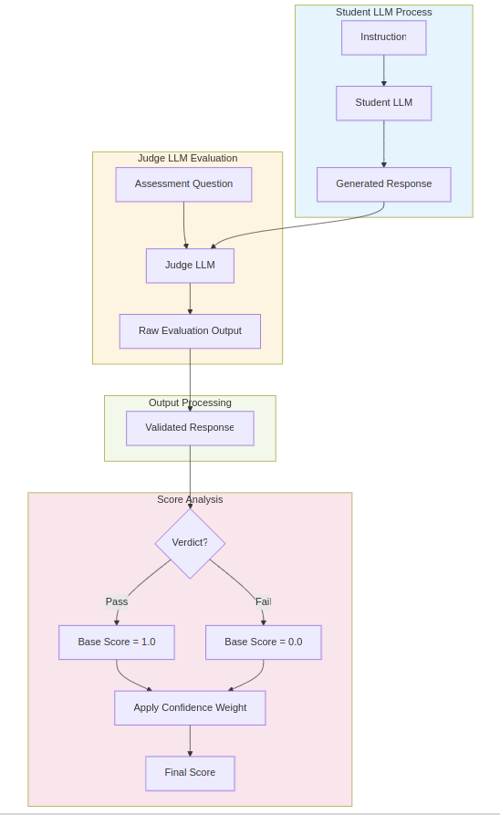

# LLMEvaluator

**LLMEvaluator** is a Python framework that automates the evaluation of Language Model (LM) outputs using the LLM-as-judge approach, where one language model evaluates the responses generated by another. This creates a scalable evaluation pipeline that maintains consistent assessment criteria across many responses.
**The framework implements a binary evaluation strategy that reduces complex assessments to Pass/Fail decisions**. This approach has two key advantages:

1. It enables to use smaller Language Model  (open source or not) to serve as judges.
2. It provides clear, unambiguous evaluation outcomes

Each evaluation includes:

- Chain-of-thought reasoning
- A binary verdict (Pass/Fail)
- Confidence level (High/Medium/Low)
- Numerical score (0-1) calculated from verdict and confidence

Furthermore, by asking multiple variations of assessment questions and combining their results, the framework can build robust statistical evaluations of LM outputs.

The tool can be used for common evaluation criteria such as **Factual accuracy** (hallucination detection), **Text alignment** with provided specifications, **Response completeness**, **Tone appropriateness**, **Instruction adherence**, **Content safety**, etc..


## Table of Contents
- [Prerequisites](#prerequisites)
- [Installation](#installation)
- [Quick Start (2 minutes)](#quick-start-2-minutes)
- [Getting Started](#getting-started)
  - [Student LLM Task](#student-llm-task)
  - [Judge LLM Evaluation](#judge-llm-evaluation)
  - [Handling Judge LLM Output](#handling-judge-llm-output)
- [Evaluation Process](#evaluation-process)
- [Structured Outputs](#structured-outputs)
  - [String Output](#1-string-output-basic)
  - [Structured Output](#2-structured-output-recommended)
  - [When to Use Each](#when-to-use-each)
- [Scoring System](#scoring-system)
  - [Scoring Logic](#scoring-logic)
  - [Usage](#usage)
- [Best Practices](#best-practices)
  - [Writing Evaluation Criteria](#writing-evaluation-criteria)
  - [Structuring Judge Prompts](#structuring-judge-prompts)
  - [Common Pitfalls](#common-pitfalls-to-avoid)
- [Real-World Examples](#real-world-examples)
- [Components](#components)
  - [LLMAgent](#llmagent)
  - [EvaluationResponse](#evaluationresponse)
  - [LLMConfig](#llmconfig)
  - [Parsing Utilities](#parsing-utilities)
  - [Models Tested as Judge](#models-tested-as-judge)
- [Tools](#tools)
  - [Assessment Question Generator](#assessment-question-generator)
  - [Student Model Runner](#student-model-runner)
  - [Future Tools](#future-tools)


## Prerequisites

- Python 3.7+
- Ollama (for running the example below) or access to another LLM platform
- An existing LLM response to evaluate (the "student" response)

The example below uses Ollama, an easy-to-use framework for running LLMs locally. To install Ollama:
1. Visit [Ollama's installation guide](https://github.com/ollama/ollama#installation)
2. Follow the instructions for your operating system
3. Run `ollama pull mistral:7b-instruct` to download a base model (or choose another model)

Note: While our example uses the model: `mistral-nemo:12b-instruct-2407-q8_0`, you can use any compatible model from Ollama or other platforms like OpenAI. Choose a model that best fits your needs in terms of performance, size, and capabilities.

## Installation

1. Clone the repository:
   ```bash
   git clone https://github.com/jmlb/llmevaluator.git
   cd llmevaluator
   ```

2. Install dependencies:
   ```bash
   pip install -r requirements.txt
   ```

## Quick Start (2 minutes)

Want to quickly evaluate LLM outputs? Here's how:

```python
import asyncio
from schemas.config import LLMConfig
from llm.agent import LLMAgent


judge_system_prompt = """
    You are an evaluator tasked with assessing responses against a specific criteria.
    Your goal is to determine whether elements are present or absent in the response.

    Important Guidelines:
    - Focus ONLY on what is explicitly stated in the response
    - Do NOT consider contextual information when evaluating
    - Think through each criterion step by step
    - Provide clear evidence from the response to support your reasoning
    - Conclude with Pass/Fail based solely on what appears in the response

    Evaluation Process:
    1. If asked "Does the response contain X?":
        - ONLY check if X appears in the response
        - Do NOT consider whether X was expected or required
        - Mark "Pass" if X is explicitly present
        - Mark "Fail" if X is not present
    """

judge_user_prompt_template = """
    **Assessment Question:**
    {assessment_question}
    
    **Student Response to Evaluate:**
    {student_response}
    
    Background (for reference only, do not use for evaluation):
    - Student Role: {student_role}
    - Student Instruction: {student_instruction}

    Example format:
    {{
        "reasoning": "The response does not mention price or cost anywhere in the text.",
        "verdict": "Fail",
        "confidence": "High"
    }}
    """

    student_instruction = """
        Generate a concise product description in paragraph format for the
        following product specifications: 4K Ultra HD 65-inch TV, HDR10+, Dolby Vision,
        Smart TV with built-in Alexa, 3 HDMI ports, Wi-Fi enabled, Energy Star certified.\n
        **Provide only the product description** without any introductory or concluding
        sentences."""

    student_response = """
        Experience stunning visuals and seamless smart home connectivity with
        our 6K Ultra HD 65-inch TV. Equipped with HDR10+ and Dolby Vision for breathtaking
        contrast and color, this exceptional display brings you closer to the action
        on your favorite movies and sports. Stream your favorite content using built-in
        Alexa, allowing voice commands and effortless navigation of popular services
        like Netflix and Amazon Prime Video. With three HDMI ports, multiple devices
        can be connected at once, and Wi-Fi enables seamless streaming from anywhere
        in your home. Certified by Energy Star, this eco-friendly TV is also designed
        to reduce energy consumption, ensuring you enjoy great entertainment while being
        kind to the environment.
        """

    assessment_question = """
    Find all technical specifications in the instruction to the student and their match if any in the student response and answer the question: Does the response of the student contain ONLY information/technical specifications provided in the instruction to the student? (Pass = derived solely from input)
    """


    user_prompt = user_prompt_template.format(
        assessment_question=assessment_question,
        student_response=student_response,
        student_role=student_role,
        student_instruction=student_instruction
    )

async def evaluate_response(config, judge_role, judge_prompt):

    # Initialize judge with string output for maximum compatibility
    judge = LLMAgent(config, result_type=str)
    

    
    # Generate evaluation using the judge LLM
    response = await judge.generate(
        system_prompt=judge_role  # How to evaluate
        prompt=judge_prompt,      # What to evaluate
    )
    
    # Print raw evaluation output
    print(response.data)
        # Configure the judge LLM with minimal settings
    cfg = LLMConfig(
        name="mistral-nemo:12b-instruct-2407-q8_0",   # Model to use as judge
        base_url="http://localhost:11434/v1",         # Ollama API endpoint
        platform="ollama",                            # LLM platform (ollama or openai)
        temperature=0                                 # Low temperature for consistent evaluation
    )
    
    # Run the async evaluation
    asyncio.run(evaluate_response(cfg))
```

Example output:
```json
{
    'reasoning': "The student response fails to include the technical specification 'HDR10+' from the instruction exactly as written. This omission results in a mismatch with the required specifications.", 
    'verdict': 'Fail', 
    'confidence': 'High'}
```

## Getting Started

### Student LLM Task

First, let's look at an example of a student LLM task and its evaluation:

```python
# Configuration for both student and judge tasks
student_role = """
You are a product expert tasked with generating **customer-friendly
product descriptions** based on provided technical specifications.
Maintain a **professional and engaging tone** to attract potential customers.
"""

# Technical specifications given to the student LLM
student_instruction = """
Generate a concise product description in paragraph format for the
following product specifications: 4K Ultra HD 65-inch TV, HDR10+, Dolby Vision,
Smart TV with built-in Alexa, 3 HDMI ports, Wi-Fi enabled, Energy Star certified.
**Provide only the product description** without any introductory or concluding
sentences.
"""

# Example response received from student LLM
student_response = """
Experience stunning visuals and seamless smart home connectivity with
our 6K Ultra HD 65-inch TV. Equipped with HDR10+ and Dolby Vision for breathtaking
contrast and color, this exceptional display brings you closer to the action
on your favorite movies and sports. Stream your favorite content using built-in
Alexa, allowing voice commands and effortless navigation of popular services
like Netflix and Amazon Prime Video. With three HDMI ports, multiple devices
can be connected at once, and Wi-Fi enables seamless streaming from anywhere
in your home. Certified by Energy Star, this eco-friendly TV is also designed
to reduce energy consumption, ensuring you enjoy great entertainment while being
kind to the environment.
"""
```

### Evaluation Process

The evaluation workflow consists of several key steps:



### Judge LLM Evaluation

Now let's implement the evaluation using LLMEvalForge:

```python
import asyncio
from schemas.config import LLMConfig
from llm.agent import LLMAgent
from schemas.evaluation import EvaluationResponse
from schemas.scoring_rvc import ScoreSchemaRVC

# Configure the judge LLM with specific parameters for evaluation
config = LLMConfig(
    name="llama3.2-vision:11b-instruct-q4_K_M",  # Model identifier
    base_url="http://localhost:11434/v1",         # Ollama API endpoint
    platform="ollama",                            # LLM platform
    temperature=0.01,                             # Low temperature for consistent evaluation
    retries=100                                   # Number of retries for robustness
)

# Define the core evaluation behavior and guidelines
system_prompt = """
You are an evaluator tasked with assessing responses against a specific criteria.
Your goal is to determine whether elements are present or absent in the response.

Important Guidelines:
- Focus ONLY on what is explicitly stated in the response
- Do NOT consider contextual information when evaluating
- Think through each criterion step by step
- Provide clear evidence from the response to support your reasoning
- Conclude with Pass/Fail based solely on what appears in the response

Evaluation Process:
1. If asked "Does the response contain X?":
   - ONLY check if X appears in the response
   - Do NOT consider whether X was expected or required
   - Mark "Pass" if X is explicitly present
   - Mark "Fail" if X is not present
"""

# Template for structuring evaluation requests
user_prompt_template = """
**Assessment Question:**
{assessment_evaluation}

**Student Response to Evaluate:**
{student_response}

Background (for reference only, do not use for evaluation):
- Student Role: {student_role}
- Student Instruction: {student_instruction}

Your task:
1. Focus ONLY on the response above
2. Evaluate against the question by checking what is explicitly present
3. Provide step-by-step reasoning using direct quotes
4. Make a Pass/Fail decision based solely on response content

Example format:
{
  "reasoning": "The response does not mention price or cost anywhere in the text.",
  "verdict": "Fail",
  "confidence": "High"
}
"""

async def main():
    # Initialize the judge agent with string output type for maximum compatibility
    judge_agent = LLMAgent(config, result_type=str)
    
    # Define specific evaluation criterion
    assessment_question = """
    Does the response contain ONLY information from the provided technical specifications? 
    (Pass = derived solely from input)
    """
    
    # Prepare the complete evaluation prompt
    user_prompt = user_prompt_template.format(
        assessment_evaluation=assessment_question,
        student_response=student_response,
        student_role=student_role,
        student_instruction=student_instruction
    )
    
    try:
        # Generate evaluation response from judge
        response = await judge_agent.generate(
            prompt=user_prompt,
            system_prompt=system_prompt
        )
        
        # Parse the raw output into structured format
        result = EvaluationResponse.parse_raw_evaluation(response.data)
        print("Evaluation Response:", result)
        
        # Convert evaluation to score for quantitative analysis
        score_schema = ScoreSchemaRVC()
        score = score_schema.get_score(result)
        print(f"Score: {score}")
        
    except Exception as e:
        print(f"An error occurred: {e}")

if __name__ == "__main__":
    asyncio.run(main())
```

Example evaluation output:
```json
{
    "reasoning": "The response contains several pieces of information not present in the technical specifications:
    1. '6K Ultra HD' instead of the specified '4K Ultra HD'
    2. Added details about 'navigation of popular services like Netflix and Amazon Prime Video'
    3. Claims about 'breathtaking contrast and color' and 'closer to the action'
    4. Additional details about streaming 'from anywhere in your home'
    While some specifications are accurately reflected (HDR10+, Dolby Vision, three HDMI ports, Wi-Fi, Energy Star), 
    the response includes marketing language and features not specified in the original requirements.",
    "verdict": "Fail",
    "confidence": "High"
}

Score: 0.0
```

### Handling Judge LLM Output

The framework provides two approaches for handling the judge's output:

1. **Basic String Output** (`result_type=str`):
   ```python
   # Initialize agent with string output
   judge_agent = LLMAgent(config, result_type=str)
   
   # Get raw response
   response = await judge_agent.generate(
       prompt=user_prompt,
       system_prompt=system_prompt
   )
   # response.data will contain raw string output
   ```
   - Use this when you want the raw LLM output
   - Doesn't use function calling, allowing compatibility with more models
   - Requires post-processing to extract structured data

2. **Structured Parsing** (`EvaluationResponse.parse_raw_evaluation()`):
   ```python
   # Parse the raw output into structured format
   result = EvaluationResponse.parse_raw_evaluation(response.data)
   # result will contain parsed {reasoning, verdict, confidence}
   ```
   - Built-in parser for various output formats
   - Automatically handles different response structures
   - Ensures consistent output format
   - Works with both function call and raw string outputs

The Getting Started example uses both approaches in sequence: first getting raw output (`result_type=str`) for maximum model compatibility, then using `parse_raw_evaluation()` to structure the output for easier processing.


## Structured Outputs

LLMEvalForge supports two approaches for handling evaluation outputs:

### 1. String Output (Basic)
As shown in the Getting Started example, using `result_type=str` returns raw string output:
```python
judge_agent = LLMAgent(config, result_type=str)
```
This approach is useful for:
- Quick prototyping and testing
- Simple evaluations where post-processing isn't needed
- Cases where you want to inspect raw LLM output
- Debugging prompt engineering

### 2. Structured Output (Recommended)
For production use, you can define a Pydantic model to structure and validate the output:

```python
from pydantic import BaseModel, Field
from typing import Literal

# Define a structured evaluation format for consistent output
class CustomEvaluation(BaseModel):
    # Required detailed explanation of the evaluation decision
    reasoning: str = Field(
        ..., 
        description="Detailed explanation of the evaluation"
    )
    
    # Binary verdict with strict type checking
    verdict: Literal["Pass", "Fail"] = Field(
        ..., 
        description="Final judgment"
    )
    
    # Confidence level with type validation
    confidence: Literal["High", "Medium", "Low"] = Field(
        ..., 
        description="Confidence level"
    )
    
# Use the custom evaluation type when initializing the agent
judge_agent = LLMAgent(config, result_type=CustomEvaluation)
```

### When to Use Each

Choose string output when:
- You're getting started with the framework
- Testing different prompt structures
- Need to debug LLM responses
- Working with simple, one-off evaluations

Choose structured output when:
- Building production systems
- Processing multiple evaluations
- Need to ensure consistent output format
- Planning to store or analyze results
- Integrating with other systems
- Want to leverage automatic validation

## Scoring System

LLMEvalForge includes a scoring system that converts the Reason-Verdict-Confidence (RVC) evaluation into numerical scores between 0 and 1. This enables:
- Quantitative comparison between different LLM outputs
- Aggregation across multiple evaluation criteria
- Performance tracking over time
- Nuanced assessment beyond binary pass/fail

### Scoring Logic

The scoring system combines the binary verdict (pass/fail) with confidence levels to produce a granular score:

```python
"""
Scoring schema for verdict-confidence combinations.

The scoring system combines a binary verdict (pass/fail) with a confidence level
to produce a final score between 0 and 1.

Scoring Logic:
-------------
1. Base verdict scores:
   - pass = 1.0
   - fail = 0.0

2. Confidence weights:
   - high   = 1.0   (100% confidence)
   - medium = 0.85  (85% confidence)
   - low    = 0.6   (60% confidence)

3. Score calculation:
   For PASS verdict:
   - Score = base_verdict(1.0) * confidence_weight
   - Example: pass_medium = 1.0 * 0.85 = 0.85
   
   For FAIL verdict:
   - Score = base_verdict(0.0) + (1 - confidence_weight)
   - Example: fail_medium = 0.0 + (1 - 0.85) = 0.15
"""

from enum import Enum
from pydantic import BaseModel, Field
from typing import Dict, Literal, Optional

class Verdict(str, Enum):
    PASS = "pass"
    FAIL = "fail"
    
    @classmethod
    def from_string(cls, value: str) -> "Verdict":
        """Convert string to Verdict, case-insensitive"""
        return cls(value.lower())

class ConfidenceLevel(str, Enum):
    HIGH = "high"
    MEDIUM = "medium"
    LOW = "low"
    
    @classmethod
    def from_string(cls, value: str) -> "ConfidenceLevel":
        """Convert string to ConfidenceLevel, case-insensitive"""
        return cls(value.lower())

class ScoreSchemaRVC(BaseModel):
    """Score schema for verdict-confidence combinations."""
    pass_high: float = Field(1.0, description="High confidence pass score")
    pass_medium: float = Field(0.85, description="Medium confidence pass score")
    pass_low: float = Field(0.6, description="Low confidence pass score")
    fail_high: float = Field(0.0, description="High confidence fail score")
    fail_medium: float = Field(0.15, description="Medium confidence fail score")
    fail_low: float = Field(0.4, description="Low confidence fail score")
    
    def get_score(self, model_output: Dict[str, str]) -> float:
        """Get the score from a model output dictionary.
        
        Args:
            model_output: Dictionary with keys 'reason', 'verdict' and 'confidence'
                Example: {"reason": "text", "verdict": "Pass", "confidence": "High"}
        
        Returns:
            float: Score between 0 and 1
        """
        verdict = Verdict.from_string(model_output['verdict'])
        confidence = ConfidenceLevel.from_string(model_output['confidence'])
        
        score_key = f"{verdict.value}_{confidence.value}"
        return getattr(self, score_key)
```

### Usage

```python
from schemas.scoring_rvc import ScoreSchemaRVC

# Create scoring schema with default weights
score_schema = ScoreSchemaRVC()

# Example evaluation result
evaluation = {
    "reasoning": "The response matches all specifications",
    "verdict": "Pass",
    "confidence": "High"
}

# Get numerical score
score = score_schema.get_score(evaluation)
print(f"Score: {score}")  # Output: Score: 1.0

# Example with custom weights
custom_schema = ScoreSchemaRVC(
    pass_high=1.0,
    pass_medium=0.8,  # Adjusted medium confidence weight
    pass_low=0.5,     # Adjusted low confidence weight
    fail_high=0.0,
    fail_medium=0.2,  # Adjusted medium confidence weight
    fail_low=0.5      # Adjusted low confidence weight
)

# Calculate score with custom weights
custom_score = custom_schema.get_score(evaluation)
```

This scoring system provides more nuanced evaluation than binary pass/fail by:
- Reflecting confidence levels in the final score
- Providing granular differentiation between responses
- Enabling mathematical operations (averaging, weighting) across multiple evaluations
- Making it easier to set thresholds and track improvements


## Best Practices

### Writing Evaluation Criteria

#### Core Principles
1. **Single-Focus Questions**
   - ✅ "Does the response mention the product's price?"
   - ❌ "Does the response mention price and available colors?"

2. **Objective Measurements**
   - ✅ "Are all technical specifications from the input present in the output?"
   - ❌ "Is the description engaging and well-written?"

3. **Clear Boundaries**
   - ✅ "Does the response contain ONLY information from the provided specifications?"
   - ❌ "Is the response good?"

4. **Evidence-Based**
   - ✅ "Quote specific text that demonstrates compliance/violation"
   - ❌ "The response seems incorrect"

### Structuring Judge Prompts

1. **System Prompt Best Practices**
```python
system_prompt = """
You are an evaluator focused on {specific_task}.

Core Requirements:
1. Evaluate ONLY what is explicitly present
2. Support decisions with direct quotes
3. Follow exact evaluation format
4. Be consistent in applying criteria

DO NOT:
- Make assumptions
- Consider implicit meaning
- Use external knowledge
"""
```

2. **User Prompt Template**
```python
user_prompt = """
Evaluation Task: {specific_criterion}

Context:
- Original Task: {task_description}
- Expected Output: {output_requirements}

Response to Evaluate:
{student_response}

Required Analysis Steps:
1. Identify relevant parts of the response
2. Compare against requirements
3. Quote evidence
4. Make Pass/Fail decision
5. Assess confidence level

Output Format:
{
    "reasoning": "Step-by-step analysis with quotes",
    "verdict": "Pass/Fail",
    "confidence": "High/Medium/Low"
}
"""
```

### Common Pitfalls to Avoid

1. **Compound Criteria**
   ```python
   # Bad
   "Does the response include features and price and warranty?"
   
   # Good
   "Does the response include the product price?"
   ```

2. **Subjective Judgments**
   ```python
   # Bad
   "Is the description compelling?"
   
   # Good
   "Does the description include all required specifications?"
   ```

3. **Implicit Requirements**
   ```python
   # Bad
   "Is the response appropriate?"
   
   # Good
   "Does the response avoid explicit content as defined in section X?"
   ```

## Real-World Examples

### Example 1: Code Documentation Evaluation
```python
# Task: Evaluate Python function documentation
task = """
Check if the function documentation includes:
1. Parameter descriptions
2. Return value description
3. Usage example
"""

student_response = '''
def calculate_total(items, tax_rate):
    """
    Calculate total cost including tax.
    
    Args:
        items (list): List of item prices
        tax_rate (float): Tax rate as decimal
    
    Returns:
        float: Total cost with tax
    
    Example:
        >>> calculate_total([10, 20], 0.1)
        33.0
    """
    return sum(items) * (1 + tax_rate)
'''

evaluation_result = {
    "reasoning": """
    1. Parameter descriptions: ✓
       - Quote: "items (list): List of item prices"
       - Quote: "tax_rate (float): Tax rate as decimal"
    2. Return value: ✓
       - Quote: "float: Total cost with tax"
    3. Usage example: ✓
       - Quote: ">>> calculate_total([10, 20], 0.1)"
    All required elements are present with clear formatting.
    """,
    "verdict": "Pass",
    "confidence": "High"
}
```

### Example 2: Product Description Alignment
```python
# Task: Evaluate alignment with specifications
specifications = """
- 4K Resolution (3840x2160)
- 120Hz Refresh Rate
- HDR10+ Support
- Price: $999.99
"""

student_response = """
Experience stunning clarity with our 4K display,
delivering incredible detail at 3840x2160 resolution.
Enjoy smooth motion with a 120Hz panel, perfect for
gaming and sports. HDR10+ support ensures vivid colors
and deep contrasts.
"""

evaluation_result = {
    "reasoning": """
    Analyzing each specification:
    1. 4K Resolution: ✓
       - Quote: "4K display... 3840x2160 resolution"
    2. 120Hz Refresh Rate: ✓
       - Quote: "120Hz panel"
    3. HDR10+ Support: ✓
       - Quote: "HDR10+ support"
    4. Price: ✗
       - No mention of $999.99 price point
    Missing required pricing information.
    """,
    "verdict": "Fail",
    "confidence": "High"
}
```

### Example 3: Content Safety Evaluation
```python
# Task: Evaluate content safety guidelines compliance
guidelines = """
Content must:
1. Be appropriate for all ages
2. Avoid explicit violence
3. Not include sensitive personal information
"""

student_response = """
The game features cartoon-style animations where
characters collect stars and dodge obstacles. Players
can earn points by completing puzzles and helping
friendly characters. High scores are displayed with
usernames only.
"""

evaluation_result = {
    "reasoning": """
    1. Age-appropriate content: ✓
       - Quote: "cartoon-style animations"
       - Quote: "collect stars and dodge obstacles"
    2. Violence check: ✓
       - No mentions of violence
       - Only non-violent actions: "collecting", "dodging", "helping"
    3. Personal information: ✓
       - Quote: "usernames only"
       - No other personal data mentioned
    Content adheres to all safety guidelines.
    """,
    "verdict": "Pass",
    "confidence": "High"
}
```


## Components

### LLMAgent
Core class handling model interactions and response generation. Located in `llm/agent.py`, it manages the lifecycle of model connections and provides a consistent interface for generating evaluations.

```python
from pydantic_ai import Agent
from pydantic_ai.models.ollama import OllamaModel
from pydantic_ai.models.openai import OpenAIModel

class LLMAgent:
    def __init__(
        self, 
        config: LLMConfig, 
        result_type: Optional[type[BaseModel]] = None
    ):
        """
        Initialize LLM agent with configuration and optional result type.
        
        Args:
            config: LLM configuration
            result_type: Optional Pydantic model to validate output
        """
        self.config = config
        self.result_type = result_type
        self._model = None
        self._agent = None

    async def generate(
        self, 
        prompt: str,
        system_prompt: Optional[str] = None
    ) -> Union[Dict[str, Any], BaseModel, str]:
        """
        Generate a response from the LLM.
        
        Args:
            prompt: The main user prompt
            system_prompt: Optional system prompt to set context
            
        Returns:
            Generated response, potentially validated against result_type
        """
        async with self() as agent:
            try:
                if system_prompt:
                    agent.system_prompt = system_prompt
                
                response = await agent.run(prompt)
                return response
            
            except Exception as e:
                print(f"Error during generation: {e}")
                return {}
```

### EvaluationResponse
Structured output format with built-in parsing capabilities:

```python
class EvaluationResponse(BaseModel):
    """Evaluation of the student response to a single question"""
    reasoning: str = Field(
        ..., 
        description="Reasoning behind the evaluation"
    )
    
    verdict: Literal["Pass", "Fail"] = Field(
        ..., 
        description="Evaluation verdict"
    )
    
    confidence: Literal["High", "Medium", "Low"] = Field(
        ..., 
        description="Confidence level of the evaluation"
    )

    @classmethod
    def parse_raw_evaluation(
        cls, 
        raw_result: str, 
        required_keys: Optional[List[str]] = None
    ) -> Optional[Dict[str, Any]]:
        """
        Parse raw output into structured format.
        
        Args:
            raw_result: Raw evaluation text
            required_keys: Required keys in output dictionary
            
        Returns:
            Parsed dictionary or None if parsing fails
        """
        if required_keys is None:
            required_keys = ["reasoning", "verdict", "confidence"]

        # Try multiple parsing methods
        parsing_methods = [
            cls._parse_json,
            cls._extract_from_json_blob,
            cls._extract_from_unstructured_text
        ]

        for method in parsing_methods:
            try:
                result = method(raw_result)
                if result and all(key in result for key in required_keys):
                    return result
            except Exception:
                continue

        return None
```

### LLMConfig
Configuration management using Pydantic models:

```python
class LLMConfig(BaseModel):
    """Configuration for language models."""
    
    # Required fields
    name: str = Field(..., description="Name/identifier of the model to use")
    
    # Optional fields with defaults
    base_url: str = Field(
        default="http://localhost:11434/v1",
        description="Base URL for the API endpoint"
    )
    platform: Literal["openai", "ollama"] = Field(
        default="ollama",
        description="Platform type (openai or ollama)"
    )
    api_key: str = Field(
        default="-",
        description="API key for authentication. Use '-' for local models."
    )
    max_tokens: Optional[int] = Field(
        default=None,
        description="Maximum number of tokens in the response"
    )
    temperature: float = Field(
        default=0.0,
        description="Sampling temperature (0.0 = deterministic, 1.0 = creative)",
        ge=0.0,
        le=1.0
    )
    timeout: int = Field(
        default=30,
        description="Request timeout in seconds",
        gt=0
    )
    retries: int = Field(
        default=1,
        description="Number of retries",
        gt=0
    )
```

### Parsing Utilities
The framework includes robust parsing utilities that can handle various output formats:

```python
def parse_raw_evaluation(raw_result: str, required_keys: Optional[List[str]] = None):
    """
    Parse evaluation output using multiple strategies.
    
    Args:
        raw_result: Raw evaluation text
        required_keys: List of required keys
    
    Returns:
        Parsed dictionary or None
    """
    if required_keys is None:
        required_keys = ["reasoning", "verdict", "confidence"]

    # Strategy 1: Direct JSON parsing
    try:
        parsed = json.loads(raw_result)
        if all(key in parsed for key in required_keys):
            return parsed
    except json.JSONDecodeError:
        pass

    # Strategy 2: Extract JSON-like content
    json_pattern = r'\{[^{}]*\}'
    match = re.search(json_pattern, raw_result)
    if match:
        try:
            parsed = json.loads(match.group(0))
            if all(key in parsed for key in required_keys):
                return parsed
        except json.JSONDecodeError:
            pass

    # Strategy 3: Parse unstructured text
    try:
        result = {}
        sections = ['reasoning:', 'verdict:', 'confidence:']
        
        for i, section in enumerate(sections):
            pattern = f"{section}(.*?)(?={sections[i+1]}|$)"
            match = re.search(pattern, raw_result.lower(), re.DOTALL)
            if match:
                key = section[:-1]  # Remove colon
                value = match.group(1).strip()
                result[key] = value

        if all(key in result for key in required_keys):
            return result
    except Exception:
        pass

    return None
```

### Models Tested as Judge
Here are open-source models that have been tested and provide reliable evaluations:

| Model Name | Platform | Function Calling Support |
|------------|----------|-------------------------|
| llama3.2-vision:11b-instruct-q4_K_M | ollama | Yes |
| Qwen2-VL-2B-Instruct-gguf | ollama | Yes |
|avcodes/flowaicom-flow-judge:q4| ollama | No |

## Tools

LThese tools complement the core evaluation functionality but are not required for basic usage.

### Assessment Question Generator
A tool to automatically generate evaluation questions based on task requirements and specifications.

<details>
<summary> Prompts </summary>
```python
NUM_QUESTIONS = 10

STUDENT_ROLE = """
    You are a product expert tasked with generating **customer-friendly product descriptions** based on provided technical specifications. 
    The descriptions must:
        - Be concise (one paragraph)
        - include ONLY information present in the technical specifications.
        - Maintain a **professional and engaging tone** to attract potential customers.
"""

SYSTEM_PROMPT_TEMPLATE = """
You are an expert evaluator tasked with generating precise Pass/Fail questions that compares 2 texts: an original text and an assistant generated text.

### Purpose of Questions:
Your task is to generate specific **Pass/Fail questions** to evaluate whether the ASSISTANT performs its assigned role effectively.
The evaluation focus is provided in the user input.

### Guidelines for Generating Questions:
1. **Contextual Focus**: Each question must align with the ASSISTANT's role and the evaluation focus provided by the user.
2. **Pass/Fail Criteria**: Each question must include clear Pass/Fail criteria:
- **Pass**: Indicates the text generated by the ASSISTANT is aligned with the original text.
- **Fail**: Indicates the ASSISTANT's generated text is nto aligned with the original text
3. **Specificity**: Each question must test only ONE specific criterion related to the evaluation focus.
4. **Question Format**: Each question must follow this exact format:
- "[Specific question]? (Pass = [Desired behavior], Fail = [Undesired behavior])"
5. **Objectivity**: Ensure all questions are measurable, clear, and objective.
6. **Avoid Speculative Questions**: 
   - Questions must not make assumptions about the content of the original text. 
   - Questions must focus on verifying the accuracy, consistency, and alignment of the generated text.

### Examples of GOOD Questions:
- If the evaluation focus is hallucinations:
- "Does the generated text contain only features present in the original text? (Pass = no extra features)"
- If the evaluation focus is alignment:
- "Does the generated text include all key points from the original text? (Pass = all key points included)"
- If the evaluation focus is tone:
- "Does the generated text maintain the same tone as the original text? (Pass = yes, same tone)"

### Examples of BAD Questions:
- ❌ "Describe how hallucinations are addressed in the input." (Directive, not evaluative)
- ❌ "What is the significance of hallucinations in the generated text?" (Ambiguous, lacks Pass/Fail criteria)

### Key Requirement:
Generate only the questions, do not include explanations, introductions, or conclusions.
"""

USER_PROMPT_TEMPLATE = """
An AI assistant is tasked with the following role:

[ASSISTANT ROLE]
{student_role}

Generate {num_questions} Pass/Fail questions to detect hallucinations in the text that would be generated by the AI assistant, 
specifically focusing on how the product description relates to the given technical specifications. 

REQUIREMENTS:
- Generate EXACTLY {num_questions} questions
- EACH question must test for hallucination in the assistant generated product description
- Use EXACT format: "[Question]? (Pass = criteria to pass)"
- Questions should directed at comparing the description to the original specifications
- Focus on detecting invented or unverified information

Provide your response ONLY as a valid Python list of strings:

[
    "[First hallucination detection question]",
    "[Second hallucination detection question]",
    ...
    "[Last hallucination detection question]"
]
"""


QUESTIONNAIRE_SYSTEM_PROMPT = SYSTEM_PROMPT_TEMPLATE

QUESTIONNAIRE_USER_PROMPT = USER_PROMPT_TEMPLATE.format(
    num_questions=NUM_QUESTIONS,
    student_role=STUDENT_ROLE
)
```
</details>

```bash
# Planned implementation
from llmevaluator.tools import QuestionGenerator

generator = QuestionGenerator(
    model="gpt-4",  # or any compatible model
    domain="product_descriptions"
)

# Generate evaluation questions from specifications
specs = """
Requirements:
- Must include all technical specifications
- Should maintain professional tone
- Must not add unsupported features
- Should be under 100 words
"""

questions = generator.generate_questions(
    specifications=specs,
    num_questions=3,
    question_type="binary"  # or "scaled", "multiple_choice"
)

# Example output:
"""
[
    "Does the response include all technical specifications listed in the input?",
    "Does the response maintain a consistently professional tone?",
    "Does the response contain only features mentioned in the specifications?"
]
"""
```

### Student Model Runner

A utility for generating responses using the student model, making it easier to create test datasets for evaluation.

```python
# Planned implementation
from llmevalforge.tools import StudentModelRunner

runner = StudentModelRunner(
    model="llama2",  # or any compatible model
    temperature=0.7,
    max_tokens=200
)

# Define task and generate responses
task = """
Generate a product description for:
- 4K Ultra HD TV
- 65-inch display
- HDR10+ support
- Built-in Alexa
"""

# Generate multiple responses
responses = runner.generate_batch(
    task=task,
    num_responses=5,
    temperature_range=(0.5, 0.9)  # vary creativity
)

# Generate responses with different prompts
prompt_variations = [
    "Write a technical description...",
    "Create a marketing-focused description...",
    "Explain the product features..."
]

responses = runner.generate_variations(
    task=task,
    prompts=prompt_variations
)
```
